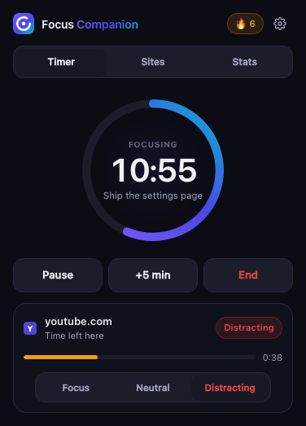
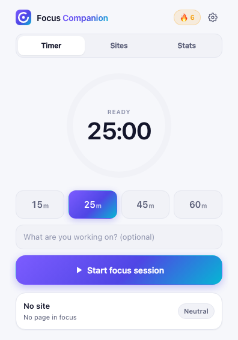
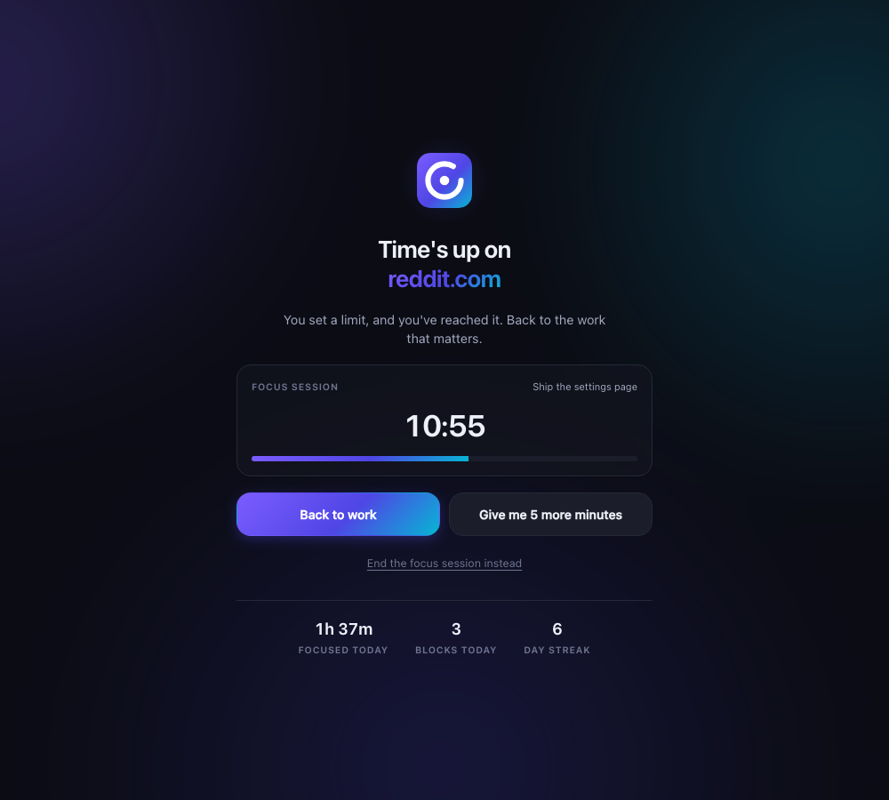
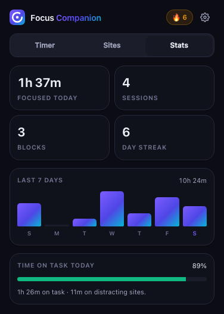
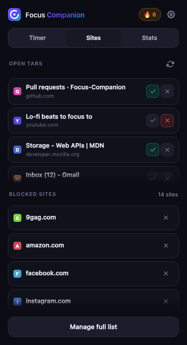
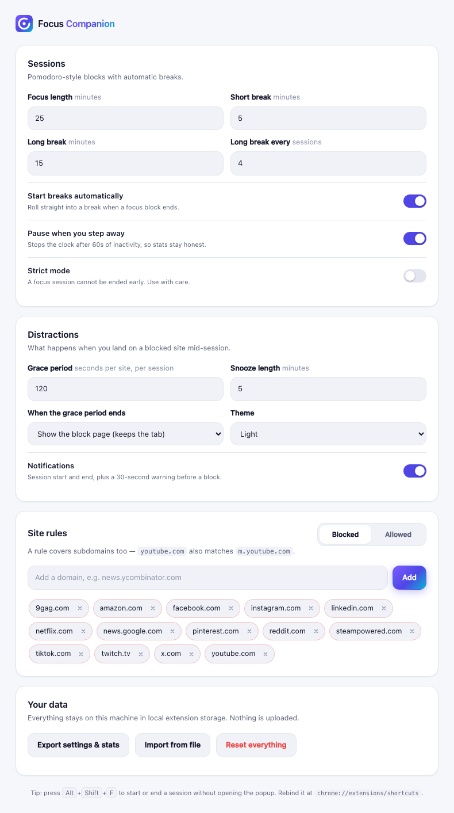

<div align="center">


# Focus Companion

**Pomodoro focus sessions that quietly hold the line on distracting sites —
and show you where your attention actually went.**




</div>

---

## Table of contents

- [What it is](#what-it-is)
- [Features](#features)
- [Running it](#running-it)
- [Using it](#using-it)
- [Settings reference](#settings-reference)
- [How it works](#how-it-works)
- [Project structure](#project-structure)
- [Development](#development)
- [Troubleshooting](#troubleshooting)
- [Privacy](#privacy)

---

## What it is

Focus Companion is a Chrome extension (Manifest V3) for people who mean to work
but end up on YouTube. You start a timed session, optionally name what you're
working on, and get on with it.

When you drift onto a site you've marked as distracting, you don't get slapped
immediately. You get a short grace period — a **time budget** for that site — and
when it runs out, the page steps aside until your session ends. Your tab isn't
closed and your work isn't lost.

Everything runs locally. There is no account, no server, and no network traffic.

---

## Features

### Focus sessions

Preset blocks of 15, 25, 45 or 60 minutes, or any length you configure. Sessions
follow a Pomodoro cycle: after each focus block a short break starts
automatically, and after every fourth block you get a long one. You can pause,
resume, or add five minutes mid-session.

**Strict mode** removes the escape hatch — once a focus session starts, it runs
to the end. There's no "End" button and no way out from the block page.

### A time budget per distracting site

Instead of an instant block, every distracting site gets a grace period (two
minutes by default) that is spent **only while that site is the tab you are
actually looking at**. This matters more than it sounds:

- A distracting site sitting in a background tab doesn't drain anything.
- Opening five YouTube tabs doesn't buy you five times the budget — the budget
  belongs to the domain, not the tab.
- Switching away and back doesn't reset the clock.

Budgets reset at the start of each focus session.

### Blocking that doesn't destroy your work

When a budget runs out, the tab is **replaced** with a calm interstitial — not
closed. Your history is intact, so "Back to work" returns you to whatever you
were doing before you wandered off. You can also snooze the site for a few
minutes if you genuinely need it.

<div align="center">

</div>

If you prefer the blunt instrument, switch **When the grace period ends** to
"Close the tab" in settings.

### Honest tracking

<div align="center">


</div>

Focused minutes, completed sessions, blocks, and a day streak, plus a seven-day
chart and a **time-on-task ratio** that separates real focus from the minutes you
spent on distracting sites while the timer ran.

The numbers are meant to be trustworthy, so:

- Walking away from the keyboard pauses the clock (configurable).
- Closing the laptop for four hours does not credit four hours of focus.
- Time spent paused is never counted.

### Sensible defaults

36 commonly distracting domains — social, video, news, shopping, games — are
blocked out of the box, so the extension is useful before you configure anything.
Every one of them can be removed, and a removal sticks.

Rules are **per-domain and cover subdomains**: one rule on `youtube.com` also
catches `m.youtube.com` and `music.youtube.com`. The most specific matching rule
wins, so you can block `reddit.com` while allowing a specific subdomain.

---

## Running it

This is an unpacked extension — there's no build step, no bundler, and no
dependencies to install. The source you clone is exactly what Chrome runs.

**Requirements:** Google Chrome 116+ (or any Chromium browser — Edge, Brave,
Arc). Node.js 18+ only if you want to run the test suite.

### 1. Get the code

```bash
git clone https://github.com/harshranjan0522/Focus-Companion.git
cd Focus-Companion
```

### 2. Load it into Chrome

1. Open `chrome://extensions` in your address bar.
2. Turn on **Developer mode** using the toggle in the top-right corner.
3. Click **Load unpacked** (top-left).
4. Select the `Focus-Companion` folder — the one containing `manifest.json`.
   Select the folder itself, not a file inside it.

The extension card should appear with no errors. A settings tab opens
automatically on first install.

### 3. Pin it

Click the puzzle-piece icon in the Chrome toolbar and pin **Focus Companion** so
the icon stays visible. The icon doubles as a timer — it shows the minutes left
in your session.

### 4. Start a session

Click the icon, pick a length, and press **Start focus session**. Or press
<kbd>Alt</kbd>+<kbd>Shift</kbd>+<kbd>F</kbd> from anywhere to start or end one
without opening the popup.

### Reloading after you change the code

Chrome does not hot-reload extensions. After editing any file:

1. Go to `chrome://extensions`.
2. Click the **↻ reload** icon on the Focus Companion card.

Popup and options pages pick up changes when you next open them, but the service
worker (`src/background.js`) only reloads on that button.

### Inspecting the service worker

Most of the logic lives in the background service worker. To watch it:

1. Go to `chrome://extensions`.
2. Click **service worker** on the Focus Companion card.

DevTools opens against the worker. Note that MV3 stops the worker when idle and
the label will read "inactive" — this is normal, not a crash. It wakes on alarms
and tab events.

To inspect stored state, run this in that DevTools console:

```js
await chrome.storage.local.get(null)
```

---

## Using it

### Classifying sites

There are three states for any domain:

| State | Meaning |
|---|---|
| **Focus** | Explicitly productive. Never blocked, never counted against you. |
| **Neutral** | Unlisted. Not blocked, but not counted as focused work either. |
| **Distracting** | Gets a time budget during focus sessions, then blocked. |

You can set these three ways:

- **The current site** — open the popup; the card at the bottom classifies
  whatever tab you're on.
- **Any open tab** — the **Sites** tab lists every open page with one-click
  Focus / Distracting toggles.
- **By hand** — the settings page takes a typed domain or a pasted URL.

### When you hit a block

The block page gives you three ways out:

- **Back to work** — returns you to the previous page in that tab's history.
- **Give me N more minutes** — snoozes that domain and returns you to it.
  Snoozes are counted in your stats.
- **End the focus session** — stops the session entirely. Hidden in strict mode.

### Reading the stats

- **Focused today** — total time the timer ran, minus pauses and idle time.
- **Sessions** — focus blocks *completed*. Abandoned ones are tracked separately.
- **Blocks** — times a budget ran out today.
- **Day streak** — consecutive days with at least one completed focus session.
- **Time on task** — focused time that wasn't spent on distracting sites. This is
  the number worth watching.

---

## Settings reference

Open with the gear icon in the popup, or from `chrome://extensions`.

<div align="center">

</div>

### Sessions

| Setting | Default | What it does |
|---|---|---|
| Focus length | 25 min | Default session length. |
| Short break | 5 min | Break after a normal focus block. |
| Long break | 15 min | Break after every *n*th block. |
| Long break every | 4 sessions | Set to `0` to disable long breaks. |
| Start breaks automatically | on | Roll straight into a break when a block ends. |
| Pause when you step away | on | Stops the clock after 60s of inactivity. |
| Strict mode | off | A focus session cannot be ended early. |

### Distractions

| Setting | Default | What it does |
|---|---|---|
| Grace period | 120 s | Budget per distracting site, per session. `0` blocks instantly. |
| Snooze length | 5 min | Granted by the block page's snooze button. |
| When the grace period ends | Block page | Or close the tab outright. |
| Theme | Match system | Light, dark, or follow the OS. |
| Notifications | on | Session start/end, plus a 30-second warning before a block. |

### Your data

**Export** writes a JSON file with your settings, rules and full history.
**Import** merges a previously exported file — existing rules are kept, not
replaced. **Reset everything** wipes all local state and needs two clicks.

---

## How it works

The interesting constraint is Manifest V3: **the service worker is killed
whenever it goes idle**, usually within 30 seconds. This is the part MV3
extensions most often get wrong, and it shapes the whole design.

**Nothing is held in a module variable across invocations.** Every handler
reloads from `chrome.storage.local`. A worker that was just torn down and
restarted behaves identically to one that has been alive for an hour.

**Every future deadline is registered with `chrome.alarms`,** which survives the
worker being killed. A `setTimeout` is used *only* as a precision supplement
(alarms are coarse) while the worker happens to be alive, and every handler that
acts on a deadline is safe to run twice.

**Time accrual is clamped and serialised.** Each heartbeat credits at most one
minute, so sleeping the laptop can't inflate your stats. Heartbeats fire from
both alarms and tab events, so they're serialised — two overlapping runs would
otherwise credit the same slice twice. The guard is re-entrancy safe, because
finishing a session auto-starts a break, which asks for another repaint.

**State is keyed by domain, not URL.** This is what makes a classification stick:
`youtube.com/watch?v=a` and `?v=b` are the same site.

Storage from version 1 is migrated automatically on first run — URL-keyed
categories collapse into domain rules, and the old minute-based threshold becomes
`graceSeconds`.

---

## Project structure

```
manifest.json            MV3 manifest, permissions, keyboard command
package.json             test runner only — the extension has no dependencies

src/
  shared.js              state schema, storage helpers, domain matching, v1 migration
  background.js          service worker: sessions, budgets, enforcement, stats, badge
  popup.html/.css/.js    timer dial, site classification, statistics
  blocked.html/.css/.js  the interstitial shown in place of a distracting page
  options.html/.css/.js  settings, rule management, import/export
  ui.css                 shared design tokens and components

icons/                   extension icons, 16–256px
assets/                  source logo (SVG + 1024px master)
docs/screenshots/        images used by this README
test/                    service-worker test suite
```

`src/shared.js` is imported by every other module — it owns the state shape, so
the popup, options page and worker can never disagree about it.

---

## Development

### Running the tests

```bash
npm test
```

No install step — the suite uses only Node's built-ins.

It drives the **real** `src/background.js` against a mocked Chrome API and a
controllable clock, so it exercises the actual shipping code rather than a copy.
Twenty tests cover:

- session lifecycle — start, pause, resume, extend, complete, abandon
- budget spending, subdomain matching, and both enforcement modes
- snoozes, idle auto-pause, and not auto-resuming a deliberate pause
- streaks, badge state, and the sleep-doesn't-inflate-stats clamp
- the v1 → v2 storage migration

Adding a case means appending a `test(...)` block in `test/run.js`; the harness in
`test/harness.js` provides `send()`, `fireAlarm()`, `setTabs()` and a fake clock.

### Working on the UI

The popup, block page and options page are plain HTML/CSS/ES modules — edit and
reload the extension to see changes. All colour, spacing and component tokens
live in `src/ui.css`; the per-page stylesheets only handle layout.

Both light and dark themes are defined with CSS custom properties. If you add a
colour, define it in the `:root` block *and* the two dark blocks
(`prefers-color-scheme` and `[data-theme="dark"]`), or it will break one theme.

### Regenerating the icons

The logo is drawn programmatically. `assets/logo.svg` is the vector used in the
UI; `icons/*.png` are rendered from the same geometry for the browser toolbar.

---

## Troubleshooting

**The extension card shows an error after loading.**
Check that you selected the folder containing `manifest.json`, not a parent or a
subfolder. Chrome must be 116 or newer.

**Distracting sites aren't being blocked.**
Blocking only happens during a **focus** session — not during breaks and not when
idle. Check the badge shows a countdown. Then confirm the site is marked
Distracting in the popup's Sites tab, and that it isn't snoozed (the popup's
current-site card will say so).

**The timer seems to stop when I'm not looking at Chrome.**
That's *Pause when you step away* doing its job after 60s of inactivity. Turn it
off in settings if you'd rather the clock kept running.

**My stats look lower than the time I actually spent.**
Only completed and in-progress session time counts, minus pauses and idle time.
Time browsing outside a session isn't tracked at all.

**Changes to the code aren't taking effect.**
Reload the extension at `chrome://extensions` — the service worker doesn't
hot-reload.

---

## Privacy

Everything stays in `chrome.storage.local` on your own machine. No account, no
network requests, no analytics, no telemetry.

The extension asks for five permissions and no host permissions at all:

| Permission | Why |
|---|---|
| `tabs` | Read the URL of the tab you're on, to tell a distracting site from a productive one. |
| `storage` | Keep your settings, rules and stats locally. |
| `alarms` | Wake the service worker when a session or budget expires. |
| `notifications` | Session start/end and the 30-second warning. |
| `idle` | Pause the clock when you step away. |

Notably it does **not** request `<all_urls>` host access — version 1 did, and it
turned out to be unnecessary. Without it the extension cannot read page content,
only the address of the tab you're currently viewing. Nothing is ever transmitted
anywhere.

You can export or erase all of it from the settings page at any time.
